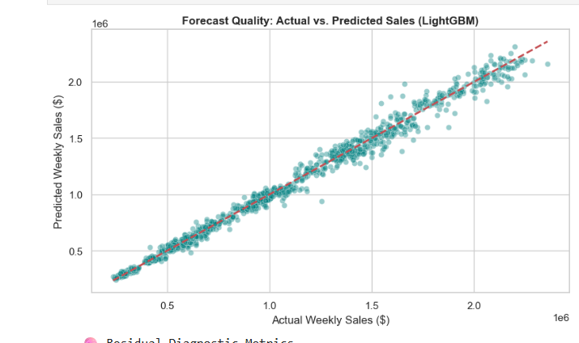
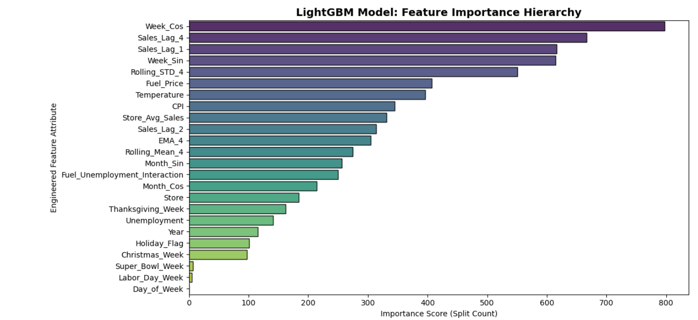

# Walmart Weekly Sales Forecasting Pipeline & Web Application

A fully modular, production-grade, end-to-end Machine Learning pipeline designed to predict weekly retail store sales using an optimized **LightGBM Champion Engine**. The system includes data ingestion, rigorous feature engineering with zero-leakage, model tracking, dynamic inference processing, a responsive Flask web interface, and automated continuous deployment (GitOps) via cloud containers.

🌐 **Live Production Link:** [https://sales-forecaster-y3b5.onrender.com](https://sales-forecaster-y3b5.onrender.com)

---

## Key Features

- **High-Performance Architecture:** Achieved a top-tier **98.95% $R^2$ Score** during cross-validation training using an optimized LightGBM regression model.
- **Advanced Feature Engineering:** Computes cyclical trigonometric time-waves (Sine/Cosine transformations for month/week), lag metrics (Lags 1, 2, and 4), rolling statistical windows (4-week rolling mean/std, EMA), and macroeconomic interaction features (Fuel Price $\times$ Unemployment).
- **Leakage-Free Validation:** Out-of-sample store baseline mapping (`store_avg_sales_meta.pkl`) generated via decoupled training splits to ensure complete validation integrity.
- **Fail-Fast Error Handling:** Built-in custom exception tracking context managers pinpointing exact script line failures across complex matrix operations.
- **Cloud Native Deployment:** Production-ready container settings served using Gunicorn workers, deployed seamlessly to Render using a continuous GitOps lifecycle.

---

## Model Performance & Visualizations

### 1. Actual vs. Predicted Sales
The model maps complex time-series trends, seasonal holiday spikes (Super Bowl, Thanksgiving, Christmas), and store-specific demand patterns with remarkable alignment.



### 2. Feature Importance Profile
The model leans heavily on robust engineered historic baseline windows (`Store_Avg_Sales`), rolling lag momentum markers, and chronological identifiers.



---

## 🗂️ Project Structure

```text
Sales-Forecasting/
├── .github/         
├── artifacts/
│   ├── model.pkl
│   └── store_avg_sales_meta.pkl
├── images/
│   ├── actual_vs_predicted.png
│   └── feature_importance.png
├── src/
│   ├── __init__.py
│   ├── exception.py
│   ├── logger.py
│   ├── utils.py
│   ├── components/ 
│   │   ├── __init__.py
│   │   ├── data_ingestion.py
│   │   ├── data_transformation.py
│   │   └── model_trainer.py
│   └── pipeline/
│       ├── __init__.py
│       ├── train_pipeline.py
│       └── predict_pipeline.py
├── templates/
│   ├── home.html
│   └── index.html
├── app.py                    
├── gunicorn_config.py 
├── requirements.txt  
└── README.md
```

---

## Engineered Features Reference

The model pipeline transforms a set of standard administrative metrics into 24 distinct machine learning feature vectors:

| Feature Name | Type | Description |
| :--- | :--- | :--- |
| `Store` | Categorical / Int64 | Target identifier for the retail branch location |
| `Month_Sin` / `Month_Cos` | Continuous Wave | Cyclical wave modeling calendar seasonality |
| `Week_Sin` / `Week_Cos` | Continuous Wave | Captures localized micro-seasonal variations within the year |
| `Sales_Lag_1` / `_2` / `_4` | Continuous Metric | Autoregressive sales shifts mapping immediate past momentum |
| `Rolling_Mean_4` / `_STD_4` | Window Aggregations | Tracks short-term variance and mean shifting bounds |
| `Fuel_Unemployment_Interaction`| Interaction Float | Models intersection of localized operational and macroeconomic pressures |
| `Store_Avg_Sales` | Continuous Baseline | Dynamic, un-leaked target encoding serving as the anchoring forecast baseline |

---

## 💻 Local Setup & Installation

Follow these steps to replicate the production pipeline environment locally on your workstation:

### 1. Clone the Project Workspace
```bash
git clone https://github.com/taiwoadex96/Sales-Forecasting.git
cd Sales-Forecasting
```

### 2. Configure a Virtual Environment
```bash
# Windows (PowerShell/CMD)
python -m venv venv
.\venv\Scripts\activate

# Mac/Linux
python3 -m venv venv
source venv/bin/activate
```

### 3. Install Package Dependencies
```bash
pip install -r requirements.txt
```

### 4. Execute the Training Workflow
To trigger data processing, run feature transformations, and serialize the LightGBM binaries:
```bash
python src/components/data_ingestion.py
```

### 5. Launch the Local User Interface
```bash
python app.py
```
Open your browser and navigate to **`http://127.0.0.1:5000/`** to generate live predictions locally.

---

## 🌐 Production Cloud Infrastructure

This system runs an enterprise **GitOps continuous delivery model**. 

- **Hosting Layer:** Deployed within a Python Web Service container running on **Render**.
- **Web Worker Routing:** Managed via **Gunicorn WSGI server processes** (`gunicorn_config.py`) that balance client traffic across available processing nodes.
- **Automated Re-Deploys:** Pushing clean changes to the `main` branch triggers an automated build cycle (`pip install -r requirements.txt`) to keep cloud binaries instantly synchronized without downtime.

---

## 📝 License
Distributed under the MIT License. See `LICENSE` for more information.